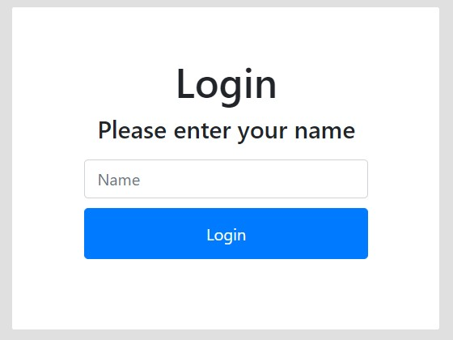
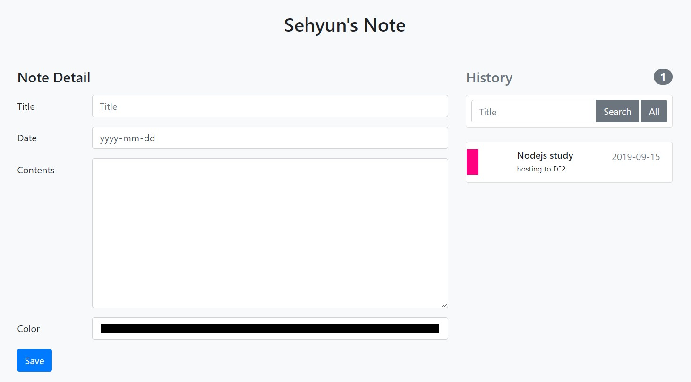

# [Note Taking App](https://sehyunnoh.github.io/NoteTaking/)
## 1. Index Page
> - save name to session storage

## 2. Main Page
> - Notes can be color-coded and modified and deleted
> - It can search the history tab for notes

## Technologies
> JavaScript, HTML5, CSS3, Bootstrap, Session Storage, Local Storage
